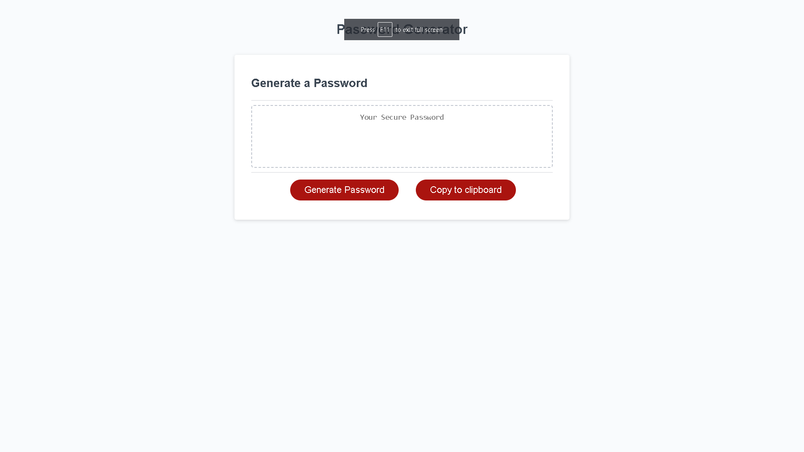

# Mod3JavascriptChallenge
Password Generator

## Description
This project was made for the user to be able to generate a secure password based on their preferences and copy it to the clipboard.

## Deployed application
https://dasantia89.github.io/Mod3JavascriptChallenge/

## Citations
w3schools was referenced for information on Javascript Object Constructors and how to copy text to the clipboard in javascript.
https://www.w3schools.com/js/js_object_constructors.asp
https://www.w3schools.com/howto/howto_js_copy_clipboard.asp